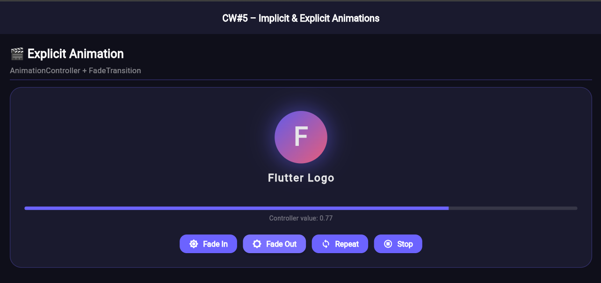
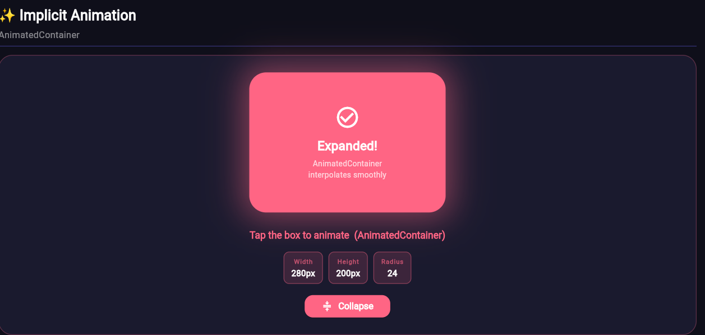

# CW#5 – Implicit & Explicit Animations in Flutter
**Members:**
22k-4307 Haseeb Mujtaba
22k-4508 Murtaza Johar
22k-4414 Shahmir
22k-4345 Saad Ahmed

---

## Overview

This project demonstrates **both implicit and explicit animations** in Flutter on a single page, as required by CW#5.

---

## Screenshots

### Explicit Animation (AnimationController + FadeTransition)


### Implicit Animation (AnimatedContainer)


## What's Inside

### 1. 🎬 Explicit Animation — `ExplicitAnimationWidget`
**File:** `lib/explicit_animation_widget.dart`

Uses **`AnimationController`** + **`FadeTransition`** to fade a logo in and out.

| Component | Role |
|---|---|
| `AnimationController` | Drives the animation timeline (0.0 → 1.0) |
| `CurvedAnimation` | Applies `Curves.easeInOut` for smooth motion |
| `FadeTransition` | Listens to the animation and adjusts widget opacity |

**Controls:** Fade In · Fade Out · Repeat · Stop  
A live progress bar shows the `AnimationController.value` in real time.

**Key concept:** Explicit animations require you to manually manage the `AnimationController` — you decide *when* the animation starts, stops, or repeats.

---

### 2. ✨ Implicit Animation — `ImplicitAnimationWidget`
**File:** `lib/implicit_animation_widget.dart`

Uses **`AnimatedContainer`** to smoothly morph a box between two states when tapped.

Properties that are automatically interpolated:

| Property | Collapsed | Expanded |
|---|---|---|
| Width | 120px | 280px |
| Height | 120px | 200px |
| Border radius | 60 (circle) | 24 (rounded rect) |
| Color | Purple `#6C63FF` | Pink `#FF6584` |

**Key concept:** Implicit animations require only a `setState()` call — Flutter detects changed values and animates between them automatically. No `AnimationController` needed.

---

## Project Structure

```
lib/
├── main.dart                     # App entry point; single page with both widgets
├── explicit_animation_widget.dart # Explicit: AnimationController + FadeTransition
└── implicit_animation_widget.dart # Implicit: AnimatedContainer
```

---

## How to Run

```bash
flutter pub get
flutter run
```

Tested on Flutter 3.x (Dart 3.x). Works on Android, iOS, and Web.

---

## Key Differences: Implicit vs Explicit

| | Implicit | Explicit |
|---|---|---|
| Widget | `AnimatedContainer`, `AnimatedOpacity`, etc. | `AnimationController` + `Transition` widgets |
| Setup | Just call `setState()` | Must create & manage `AnimationController` |
| Control | Flutter handles timing automatically | Full manual control (forward, reverse, repeat) |
| Use when | Simple state-based transitions | Complex, sequenced, or user-driven animations |